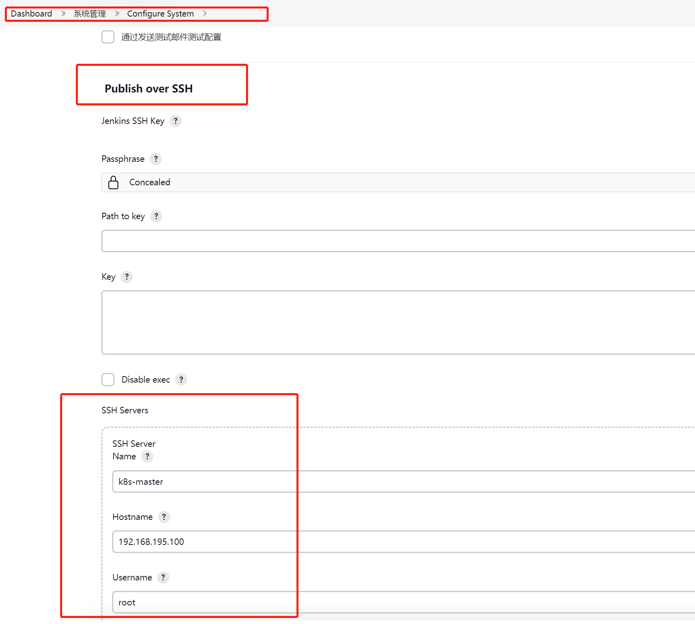
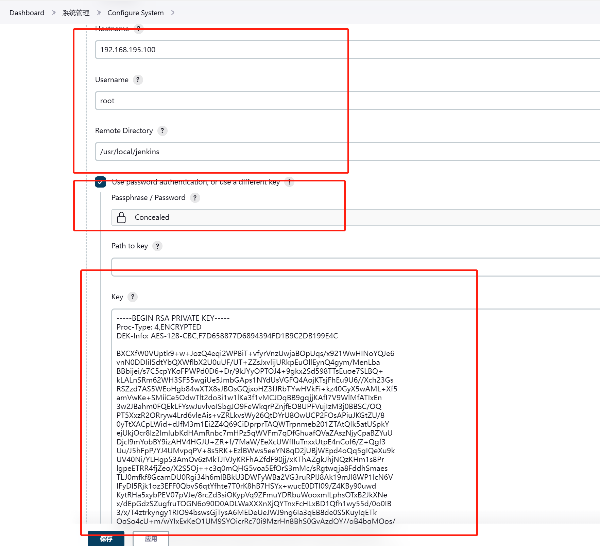

## 安装

我安装的是最新版的jenkins，环境要求java11 + 

### 遇到的问题

按照官网教程，一直无法正常启动，本身环境为java 11，报错openjdk8无效

```
sudo wget -O /etc/yum.repos.d/jenkins.repo \
    https://pkg.jenkins.io/redhat/jenkins.repo
sudo rpm --import https://pkg.jenkins.io/redhat/jenkins.io.key
sudo yum upgrade
# Add required dependencies for the jenkins package
sudo yum install java-11-openjdk
sudo yum install jenkins
```

解决方法：因为新版本jenkins已经不支持jdk8，所以要删除环境中的jdk8

```
yum list java* 

把所有jdk1.8的安装包全部删除
```

```
查看状态
systemctl status jenkins

jenkins启动

#service jenkins start

重启

#service jenkins restart
停止

#service jenkins stop
```


## CI/CD 

### 插件安装

安装插件

- git Parameter
- publish over ssh

### 系统配置-连接远程目标服务器

通过ssh-key，连接需要部署的服务器

1. 在jenkins所在的服务器输入，` ssh-keygen -t rsa` 在~/.ssh目录下生成公钥和私钥
2. 在远程目标服务器的`~/.ssh`目录下新建`authorized_keys`文件，并把第一步的公钥复制进去
3. 在jenkins界面配置如下内容，并且将私钥复制





### 流水线语法

```
pipeline {
    // 指定集群中机器
    agent any

    // 存放所有任务的合集
    stages {
        stage('pull git code') {
            steps {
                echo '拉取Git代码-成功'
            }
        }

        stage('maven build') {
            steps {
                echo 'maven构建项目-成功'
            }
        }

        stage('code detection') {
            steps {
                echo '检测代码质量-成功'
            }
        }

        stage('build docker image') {
            steps {
                echo '构建自定义镜像-成功'
            }
        }

        stage('push image to Harbor') {
            steps {
                echo '镜像发布到发布Harbor-成功'
            }
        }

        stage('notify server and deploy') {
            steps {
                echo '通知目标服务器部署项目-成功'
            }
        }
    }
}
```

